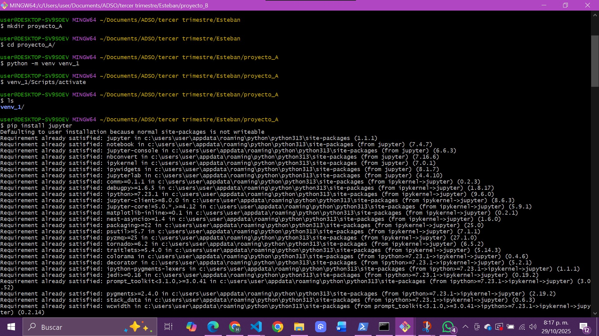
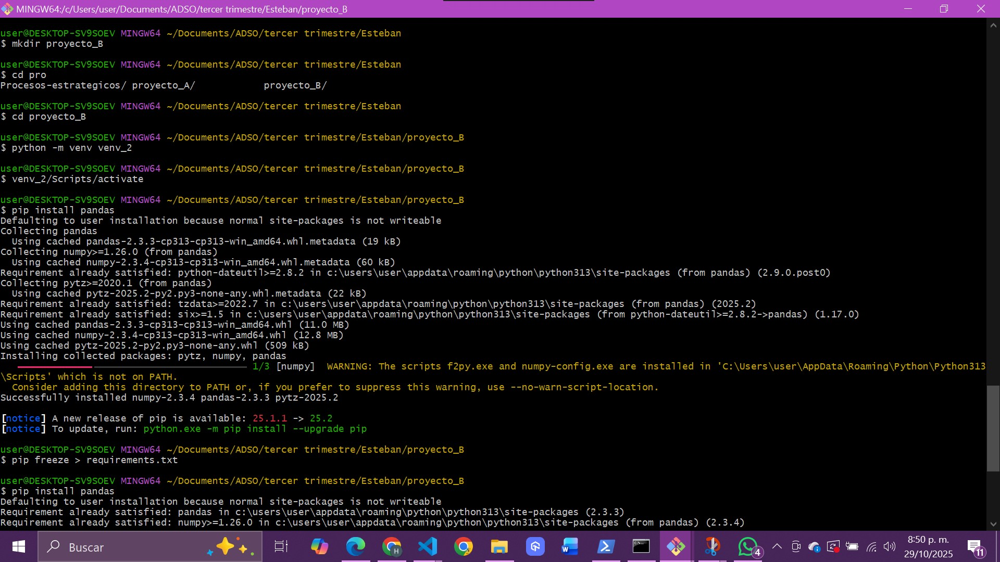
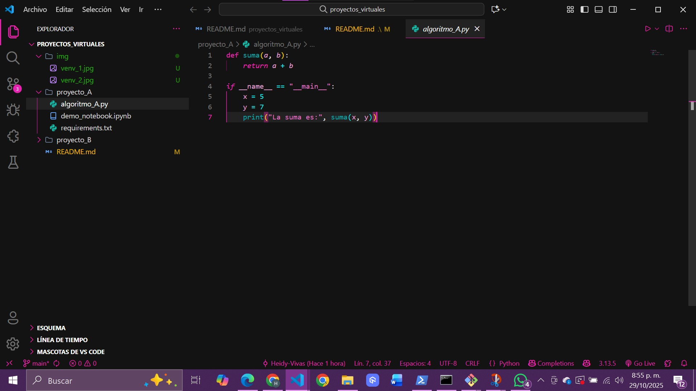
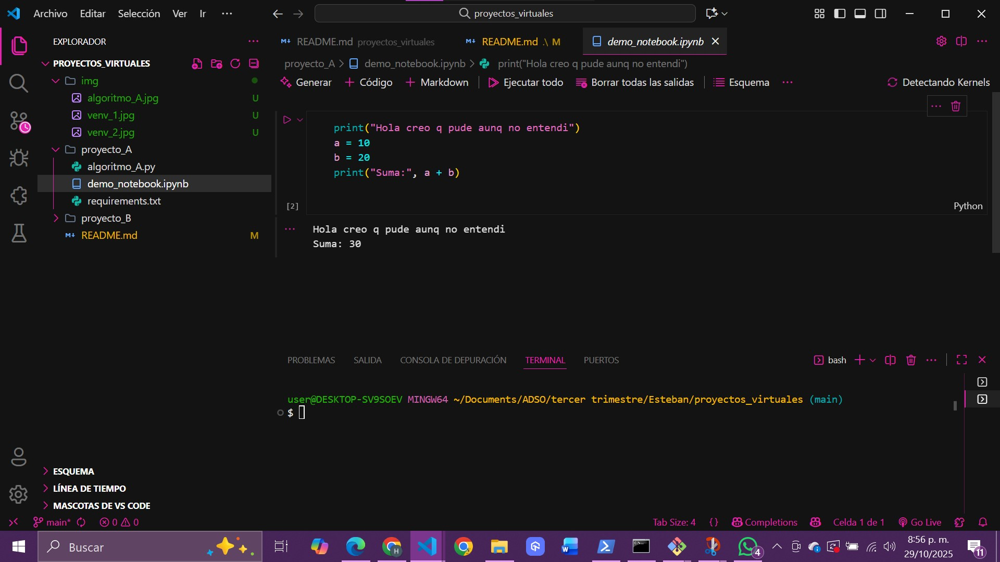
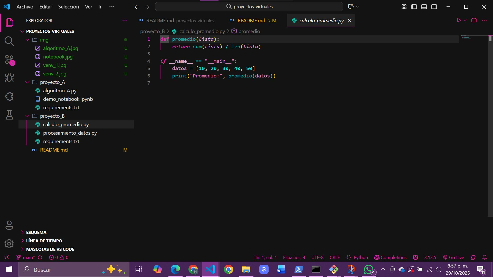
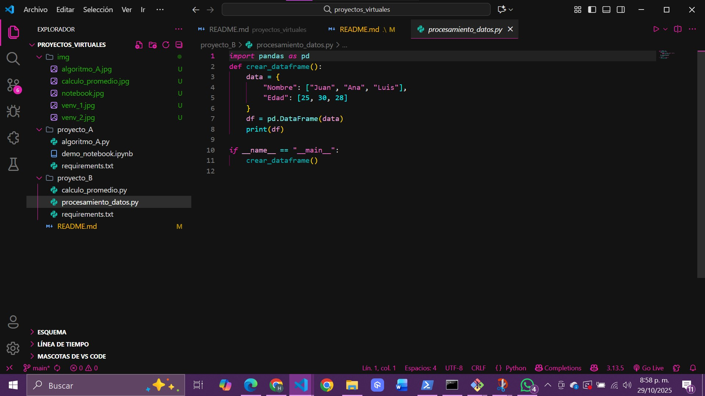
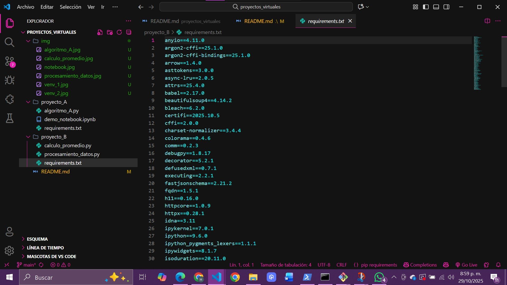
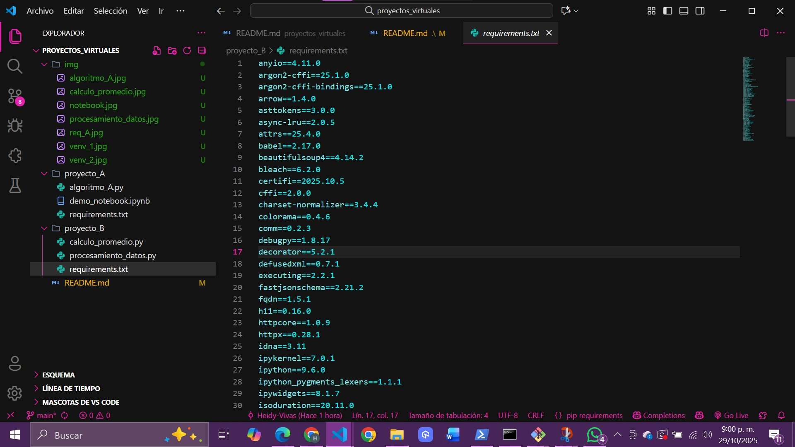
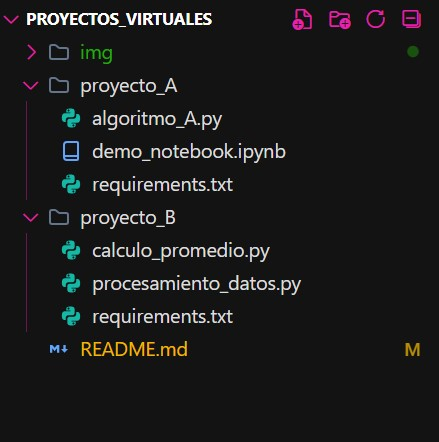

## 🧩 Instrucciones básicas

### Crear entornos virtuales
```bash
# Proyecto A
cd proyecto_A
python -m venv venv_1
venv_1\Scripts\activate    
pip install jupyter
pip freeze > requirements.txt
# pasa lo mismo con Proyecto B
```
**Versión de Python utilizada:** Python 3.11.2

## 📘 Descripción General
Este repositorio contiene dos proyectos independientes que utilizan entornos virtuales separados:

- **Proyecto A:** utiliza Jupyter para ejecutar un notebook y un script Python.
- **Proyecto B:** utiliza pandas para manipulación básica de datos con dos scripts.


---

## 📂 Estructura del repositorio
📦 proyectos_virtuales/
┣ 📂 proyecto_A/
┃ ┣ 📜 algoritmo_A.py
┃ ┣ 📜 demo_notebook.ipynb
┃ ┣ 📜 requirements.txt
┃ ┗ 📁 venv_1/ (eliminado)
┣ 📂 proyecto_B/
┃ ┣ 📜 calculo_promedio.py
┃ ┣ 📜 procesamiento_datos.py
┃ ┣ 📜 requirements.txt
┃ ┗ 📁 venv_2/ (eliminado)
┗ 📜 README.md

---

## 🧠 Evidencias (Capturas solicitadas)
1. Creación y activación de los entornos virtuales (`venv_1` y `venv_2`).
3. Instalación de los paquetes `jupyter` y `pandas`.
4. Ejecución de los scripts (`algoritmo_A.py`, `calculo_promedio.py`, `procesamiento_datos.py`).
5. Ejecución del notebook `demo_notebook.ipynb`.
6. Contenido de los `requirements.txt`.
7. Estructura de carpetas visible en Visual Studio Code 

**
**  
**
**
**
**
**
**
**
---